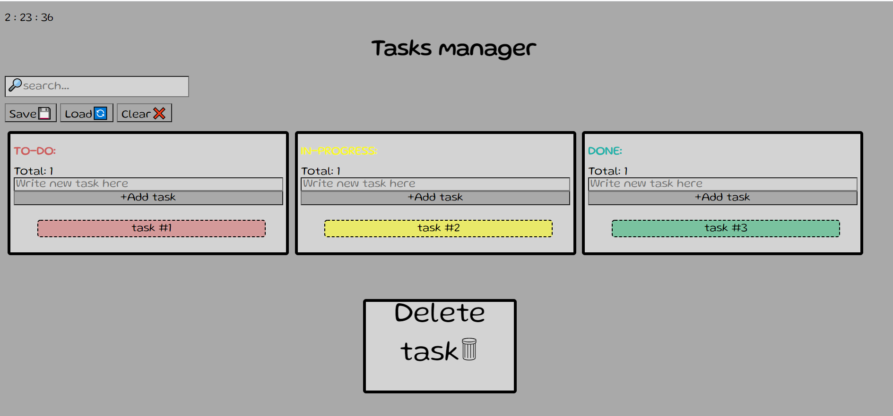

# Cyber4s 3rd Pre-Course Final Project : KAN-BAN task-management application-

## My solution for task-management application-
The solution is in the solution folder. Written using 
* HTML
* JS
* CSS 

---
## Getting Started
---
### My GIT-HUB PAGE
https://ramabadash.github.io/kanban-final/solution/
### Open localy-

### Installation
1. Clone the repo 
https://github.com/ramabadash/kanban-final/tree/kanban-solution-0.1

2. Install NPM packages
`npm run final <your name> (replace <your name> with your name)`
---
## Page Structure
---
* **Search bar -** Input line. You can search among the existing tasks. Tasks will appear and disappear depending on the input each time you press the keyboard.  
* **Save & Load buttons** - You can save the page content and restore it from the external API memory.
* **Clear button -** You can clear the page of tasks as well as your local storage.

 **3 Tasks section - TO DO, IN - PROGRESS , DONE-**

* **Total -** Total tasks in section. Updated regularly.
* **Input -** You can enter the contents of the new task.
* **Add button -** Add a new task to the top of the list based on the content in the Input above.
* **Tasks -** The various tasks to be performed. Background color depending on the position between the lists.
* **Delete task -** A task can be dragged to the area and it will be deleted.

---- 
## Interaction
---
* **Add new task -** Add a new task to the top of the list based on the content in the Input above. You will not be able to add an empty task!
* **Edit task content -** With a double click you can edit the content of the task. When you leave the task the content will be saved in both the local and local storage.
* **Swich task list -** Option one: You can stand over the task and press alt + [1-3] and the task will move to one of the 3 lists.
Second option: drag the task and place it on the list you want. 
* **Search -** The search input filter on every keystroke tasks case-insensitively, so that only tasks that match the search string are displayed.

**Extra**
* **Task background -** The background of the task will adapt itself to the list in which it is located.
* **Opening messege -** Each time the page is reloaded, a message will be displayed according to the time of day.
* **Clock -** Shown on the top left is the current time for the current moment.
* **Good job -** Whenever a task gets done it will display gif - good job.
* **Total -** Total tasks in section. Updated regularly.
* **Delete task -** A task can be dragged to the area and it will be deleted.

---
## Storage
---
* **Local storage -** Any change on the page will be saved immediately in the local storage without the need for active action of the user.

* **API storage -** When you click the save button specified above, the information on the page will be saved in its current form in the API storage. By clicking on the load button the information will be displayed on the page as recently saved in the API even if it is different in the local storage. Local storage will be updated accordingly.

---
## Future
---
* **Priority selection -** It will be possible to select a background for the task according to the urgency of the task - Low, medium, high.
* **Date -** For each task and displayed the date on which it was added.

